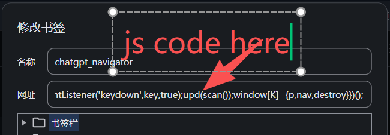
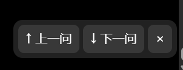

# ChatGPT Conversation Navigator

A lightweight bookmarklet for navigating between user prompts in long ChatGPT conversations.

The script adds a small floating navigation panel to ChatGPT:

* `↑ Previous Prompt`
* `↓ Next Prompt`
* `× Exit`

It is designed for long conversations where browser scrolling or ChatGPT's built-in navigation may skip turns or behave inconsistently.

No browser extension is required.

---

## Features

* Navigate to the previous user prompt.
* Navigate to the next user prompt.
* Keyboard shortcuts:

  * `Alt + ↑` — Previous prompt
  * `Alt + ↓` — Next prompt
* Works as a browser bookmarklet.
* No Tampermonkey or other extension required.
* Handles long assistant responses.
* Uses currently rendered ChatGPT message nodes instead of relying on fixed scroll distances.
* Maintains a lightweight history of message nodes observed in the viewport.
* Uses assistant messages as navigation anchors when the adjacent user prompt is not currently visible.
* Clicking `×` completely disables the script for the current page:

  * removes the floating panel;
  * removes keyboard listeners;
  * clears the script instance.
* The bookmarklet can be clicked again to enable it again.

---

## Why This Exists

In very long ChatGPT conversations, navigating between prompts can be inconvenient.

A conversation may look like this:

```text
User Prompt A
Assistant Response A
Assistant Response A
Assistant Response A
... very long response ...

User Prompt B
Assistant Response B
```

When the assistant response is very long, simple scrolling shortcuts do not always land on the corresponding user prompt.

Another complication is that ChatGPT may dynamically remove distant message nodes from the DOM and restore them later as the page is scrolled.

This bookmarklet therefore avoids assuming that every conversation turn is permanently present in the DOM.

Instead, it works primarily with:

```text
[data-message-author-role="user"]
[data-message-author-role="assistant"]
```

and uses the nodes currently available around the viewport to navigate.

---

## Navigation Model

The script follows several simple rules.

### Current prompt

If one or more user-message nodes are visible in the viewport, the first visible user message is treated as the current prompt.

### Previous prompt

The script first checks whether the previous user prompt can already be identified from the currently available DOM and previously observed message order.

If not, it finds the relevant assistant message and moves that assistant message near the top of the viewport.

After ChatGPT updates the surrounding DOM, the script scans again and locates the previous user prompt.

### Next prompt

The same strategy is used in the opposite direction.

If the next user prompt can already be identified reliably, the script jumps directly to it.

Otherwise, the adjacent assistant response is repositioned so that ChatGPT loads the nearby conversation nodes, after which the script scans again for the next user prompt.

---

## Installation



### Chrome / Edge / Chromium-based Browsers

1. Show the bookmarks bar.

   On Windows/Linux:

   ```text
   Ctrl + Shift + B
   ```

   On macOS:

   ```text
   Cmd + Shift + B
   ```

2. Create a new bookmark.

3. Give it a name such as:

   ```text
   ChatGPT Navigator
   ```

4. Paste the bookmarklet JavaScript into the bookmark's **URL / Address** field.

  ```javascript
  javascript:(()=>{const K='__cgNav4',C={y:100,w:200,j:3};if(window[K]){window[K].p.style.display='flex';return}const G=[],M=new Map(),sl=n=>new Promise(r=>setTimeout(r,n)),nm=s=>(s||'').replace(/\s+/g,' ').trim();let busy=0;function hs(s){let h=2166136261;for(let i=0;i<s.length;i++){h^=s.charCodeAt(i);h=Math.imul(h,16777619)}return(h>>>0).toString(36)+':'+s.length}function scan(){return[...document.querySelectorAll('[data-message-author-role="user"],[data-message-author-role="assistant"]')].map(e=>{const r=e.getBoundingClientRect(),role=e.getAttribute('data-message-author-role'),txt=nm(e.innerText||e.textContent),t=e.closest('[data-testid^="conversation-turn-"]')?.getAttribute('data-testid')||'';return{e,r,role,txt,k:hs(role+'\0'+txt)+(t?'@'+t:'')}})}function vis(a){return a.filter(x=>x.r.bottom>0&&x.r.top<innerHeight&&x.r.height>0).sort((a,b)=>a.r.top-b.r.top)}function upd(a){const v=vis(a);if(!v.length)return;if(!G.length){for(const x of v){if(M.has(x.k))continue;const g={k:x.k,role:x.role};G.push(g);M.set(g.k,g)}return}let ch=1,n=0;while(ch&&n++<v.length+1){ch=0;for(let i=0;i<v.length-1;i++){const a=v[i],b=v[i+1],A=M.has(a.k),B=M.has(b.k);if(A&&!B){const j=G.findIndex(x=>x.k===a.k),g={k:b.k,role:b.role};G.splice(j+1,0,g);M.set(g.k,g);ch=1}else if(!A&&B){const j=G.findIndex(x=>x.k===b.k),g={k:a.k,role:a.role};G.splice(j,0,g);M.set(g.k,g);ch=1}}}}function cu(a){return vis(a).find(x=>x.role==='user')||null}function near(a,x,role,d){let i=a.findIndex(n=>n.k===x.k);for(i+=d;i>=0&&i<a.length;i+=d)if(a[i].role===role)return a[i];return null}function gu(k,d){let i=G.findIndex(x=>x.k===k);for(i+=d;i>=0&&i<G.length;i+=d)if(G[i].role==='user')return G[i];return null}function jump(x){if(!x)return;const o=x.e.style.scrollMarginTop;x.e.style.scrollMarginTop=C.y+'px';x.e.scrollIntoView({behavior:'instant',block:'start'});requestAnimationFrame(()=>x.e.style.scrollMarginTop=o)}function sc(e){for(let x=e?.parentElement;x&&x!==document.body;x=x.parentElement){const s=getComputedStyle(x);if(/auto|scroll/.test(s.overflowY)&&x.scrollHeight>x.clientHeight+20)return x}return document.scrollingElement}function boxScroller(e){const s=sc(e);return s===document.scrollingElement||s===document.documentElement||s===document.body?document.scrollingElement:s}function scrollScreens(e,d,n=C.j){const x=boxScroller(e),h=x.clientHeight||innerHeight;x.scrollBy({top:d*n*h,behavior:'instant'})}function topTo100(x){const o=x.e.style.scrollMarginTop;x.e.style.scrollMarginTop=C.y+'px';x.e.scrollIntoView({behavior:'instant',block:'start'});requestAnimationFrame(()=>x.e.style.scrollMarginTop=o)}function bottomTo100(x){const o=x.e.style.scrollMarginBottom;x.e.style.scrollMarginBottom=Math.max(0,innerHeight-C.y)+'px';x.e.scrollIntoView({behavior:'instant',block:'end'});requestAnimationFrame(()=>x.e.style.scrollMarginBottom=o)}function anchor(a,k,d){const c=a.find(x=>x.k===k);if(c){const n=near(a,c,'assistant',d);if(n&&(d>0||n.r.top<0))return n}const va=vis(a).filter(x=>x.role==='assistant');return d<0?(va[0]||null):(va[va.length-1]||null)}async function viaAssistant(a,d){if(d<0)topTo100(a);else bottomTo100(a);await sl(C.w);const b=scan();upd(b);const aa=b.find(x=>x.k===a.k),u=aa?near(b,aa,'user',d):cu(b);if(u){jump(u);return true}return false}async function nav(d){if(busy)return;busy=1;try{let a=scan();upd(a);const c=cu(a);if(c){const du=near(a,c,'user',d),g=gu(c.k,d);if(du&&g&&du.k===g.k){jump(du);return}let as=anchor(a,c.k,d);if(as&&await viaAssistant(as,d))return;scrollScreens(c.e,d);await sl(C.w);a=scan();upd(a);as=anchor(a,c.k,d);if(as)await viaAssistant(as,d);return}let as=anchor(a,'',d);if(as&&await viaAssistant(as,d))return;const seed=vis(a)[0]||a[0];if(!seed)return;scrollScreens(seed.e,d);await sl(C.w);a=scan();upd(a);as=anchor(a,'',d);if(as)await viaAssistant(as,d)}finally{busy=0}}const p=document.createElement('div');Object.assign(p.style,{position:'fixed',right:'18px',bottom:'22px',zIndex:2147483647,display:'flex',gap:'5px',padding:'6px',borderRadius:'12px',background:'rgba(35,35,35,.94)'});function b(t,f){const x=document.createElement('button');x.textContent=t;Object.assign(x.style,{border:0,borderRadius:'8px',padding:'7px 10px',background:'rgba(255,255,255,.1)',color:'#fff',cursor:'pointer'});x.onclick=f;return x}function key(e){const a=document.activeElement;if(e.repeat||a&&(a.tagName==='INPUT'||a.tagName==='TEXTAREA'||a.isContentEditable))return;if(e.altKey&&!e.ctrlKey&&!e.metaKey&&!e.shiftKey&&e.key==='ArrowUp'){e.preventDefault();e.stopImmediatePropagation();nav(-1)}else if(e.altKey&&!e.ctrlKey&&!e.metaKey&&!e.shiftKey&&e.key==='ArrowDown'){e.preventDefault();e.stopImmediatePropagation();nav(1)}}function destroy(){window.removeEventListener('keydown',key,true);p.remove();delete window[K]}p.append(b('↑ 上一问',()=>nav(-1)),b('↓ 下一问',()=>nav(1)),b('×',destroy));document.body.appendChild(p);window.addEventListener('keydown',key,true);upd(scan());window[K]={p,nav,destroy}})();
  ```

6. Save the bookmark.

---

## Usage


1. Open a conversation on:

   ```text
   https://chatgpt.com/
   ```

2. Click the `ChatGPT Navigator` bookmark.

3. A floating control will appear in the bottom-right corner.

4. Use:

   ```text
   ↑ Previous Prompt
   ↓ Next Prompt
   ```

   or the keyboard shortcuts:

   ```text
   Alt + ↑
   Alt + ↓
   ```

5. Click:

   ```text
   ×
   ```

   to completely stop the script on the current page.

After exiting, the keyboard shortcuts will no longer be intercepted.

To enable the navigator again, click the bookmarklet again.

---

## Behavior in the ChatGPT Input Box

The keyboard shortcuts are disabled while focus is inside:

* text inputs;
* textareas;
* content-editable elements.

This prevents `Alt + ↑` and `Alt + ↓` from interfering with normal text editing.

---

## How It Works

The script scans ChatGPT message elements using:

```javascript
[data-message-author-role="user"]
[data-message-author-role="assistant"]
```

Each detected message is identified using:

* its role;
* its text content;
* its nearest conversation-turn identifier when available.

The script also keeps a lightweight ordered list of message nodes that have actually appeared in the viewport.

Only viewport-observed ordering is trusted for extending this history.

This is intentional because distant ChatGPT DOM nodes may be virtualized, detached, or positioned far outside the visible document.

---

## Long Responses

A single assistant response may be tens of thousands of pixels tall.

Instead of calculating a large raw scroll offset, the navigator uses browser-native element positioning.

For upward navigation, an assistant message can be positioned approximately:

```text
100px from the top of the viewport
```

For downward navigation, the bottom of an assistant response can be positioned near the same reference area.

The surrounding DOM is then scanned again for the corresponding user prompt.

---

## Limitations

This project depends on ChatGPT's current web-page DOM structure.

OpenAI may change:

* message attributes;
* conversation containers;
* virtualization behavior;
* scrolling containers;
* page layout.

Such changes may temporarily break the bookmarklet.

The script currently relies primarily on:

```html
data-message-author-role="user"
data-message-author-role="assistant"
```

If these attributes change, the selectors may need to be updated.

Navigation may also be less reliable while:

* a response is still being generated;
* the page is rapidly loading conversation history;
* ChatGPT is rebuilding the DOM during navigation;
* browser extensions significantly modify the ChatGPT page.

---

## Privacy

The bookmarklet runs locally inside the currently open ChatGPT page.

It does not intentionally:

* send conversation content to an external server;
* make network requests;
* collect analytics;
* store conversations remotely.

Message text is only inspected locally to identify and order conversation nodes.

You should still review any bookmarklet code before running it in your browser.

---

## Security

Bookmarklets execute JavaScript in the context of the page you are viewing.

Only install bookmarklets from sources you trust.

Before using this project, review the source code and verify that it does not contain unexpected network requests, credential access, or data collection behavior.

---

## Development

The project intentionally avoids browser-extension APIs.

The core implementation is plain JavaScript so it can run as a bookmarklet.

The main areas of the implementation are:

```text
scan messages
↓
identify visible user / assistant nodes
↓
maintain observed message order
↓
identify current user prompt
↓
use adjacent assistant nodes as navigation anchors
↓
rescan
↓
jump to the target user prompt
```

Keeping the logic small is important because bookmark URLs have practical length limits in some browsers.

---

## Contributing

Issues and pull requests are welcome.

Useful reports should include:

* browser name and version;
* operating system;
* whether the problem occurs with Previous or Next navigation;
* whether the current assistant response is unusually long;
* a summary of the visible DOM behavior;
* any relevant selector changes observed in ChatGPT.

Please avoid posting private conversation content in public issues.

---

## License

MIT License.

---

# ChatGPT 对话导航器

一个用于在 ChatGPT 长对话中快速切换用户提问的轻量级 Bookmarklet（书签脚本）。

脚本会在 ChatGPT 页面右下角增加一个小型导航面板：

* `↑ 上一问`
* `↓ 下一问`
* `× 退出`

它主要用于解决长对话中浏览器滚动或 ChatGPT 自带导航可能出现跳过多轮、定位不准确的问题。

无需安装任何浏览器扩展。

---

## 功能

* 跳转到上一个用户提问。
* 跳转到下一个用户提问。
* 支持快捷键：

  * `Alt + ↑` — 上一问
  * `Alt + ↓` — 下一问
* 以浏览器书签脚本形式运行。
* 不需要 Tampermonkey 或其他扩展。
* 能处理非常长的 Assistant 回答。
* 不依赖固定滚动距离来判断用户提问。
* 维护一个轻量的、已经在视窗中确认过的消息节点顺序。
* 当目标用户提问暂时不可见时，可以利用 Assistant 消息作为滚动锚点。
* 点击 `×` 后会真正退出脚本：

  * 删除悬浮面板；
  * 删除键盘事件监听；
  * 清除当前脚本实例。
* 退出后再次点击书签即可重新启用。

---

## 为什么需要这个项目

在非常长的 ChatGPT 对话中，上一轮和下一轮的定位可能并不方便。

例如：

```text
用户问题 A
Assistant 回答 A
Assistant 回答 A
Assistant 回答 A
……回答非常长……

用户问题 B
Assistant 回答 B
```

如果 Assistant 的回答非常长，简单的滚动快捷键未必能够准确定位到对应的用户问题。

另一个问题是 ChatGPT 会动态管理页面 DOM。

距离当前视窗较远的消息节点可能被暂时从 DOM 中摘除，在滚动到附近以后再重新加载。

因此，这个 Bookmarklet 不假设整个对话的所有节点始终存在于 DOM 中。

它主要检测：

```text
[data-message-author-role="user"]
[data-message-author-role="assistant"]
```

并利用当前视窗附近实际存在的节点进行导航。

---

## 导航逻辑

脚本遵循几个相对简单的原则。

### 当前问题

如果当前视窗中存在一个或多个 User 消息节点：

```text
视窗中最靠上的 User 消息
```

会被视为当前问题。

### 上一问

脚本首先判断当前 DOM 以及已经观察到的消息顺序中，是否能够可靠确定上一个 User 节点。

如果可以，则直接跳转。

如果不能，则寻找与当前位置相关的 Assistant 节点，把它移动到视窗顶部附近。

ChatGPT 更新附近 DOM 后，脚本重新扫描并寻找对应的上一条 User 消息。

### 下一问

下一问采用相反方向的同样逻辑。

如果当前已经能够可靠确定下一个 User 节点，就直接跳转。

否则，通过调整相邻 Assistant 回答的位置，让 ChatGPT 加载附近的消息节点，再重新寻找下一个 User 节点。

---

## 安装


### Chrome / Edge / Chromium 浏览器

1. 显示书签栏。

   Windows / Linux：

   ```text
   Ctrl + Shift + B
   ```

   macOS：

   ```text
   Cmd + Shift + B
   ```

2. 新建一个书签。

3. 名称可以填写：

   ```text
   ChatGPT Navigator
   ```

   或：

   ```text
   ChatGPT 对话导航
   ```

4. 将项目提供的 Bookmarklet JavaScript 完整粘贴到书签的：

   ```javascript
   javascript:(()=>{const K='__cgNav4',C={y:100,w:200,j:3};if(window[K]){window[K].p.style.display='flex';return}const G=[],M=new Map(),sl=n=>new Promise(r=>setTimeout(r,n)),nm=s=>(s||'').replace(/\s+/g,' ').trim();let busy=0;function hs(s){let h=2166136261;for(let i=0;i<s.length;i++){h^=s.charCodeAt(i);h=Math.imul(h,16777619)}return(h>>>0).toString(36)+':'+s.length}function scan(){return[...document.querySelectorAll('[data-message-author-role="user"],[data-message-author-role="assistant"]')].map(e=>{const r=e.getBoundingClientRect(),role=e.getAttribute('data-message-author-role'),txt=nm(e.innerText||e.textContent),t=e.closest('[data-testid^="conversation-turn-"]')?.getAttribute('data-testid')||'';return{e,r,role,txt,k:hs(role+'\0'+txt)+(t?'@'+t:'')}})}function vis(a){return a.filter(x=>x.r.bottom>0&&x.r.top<innerHeight&&x.r.height>0).sort((a,b)=>a.r.top-b.r.top)}function upd(a){const v=vis(a);if(!v.length)return;if(!G.length){for(const x of v){if(M.has(x.k))continue;const g={k:x.k,role:x.role};G.push(g);M.set(g.k,g)}return}let ch=1,n=0;while(ch&&n++<v.length+1){ch=0;for(let i=0;i<v.length-1;i++){const a=v[i],b=v[i+1],A=M.has(a.k),B=M.has(b.k);if(A&&!B){const j=G.findIndex(x=>x.k===a.k),g={k:b.k,role:b.role};G.splice(j+1,0,g);M.set(g.k,g);ch=1}else if(!A&&B){const j=G.findIndex(x=>x.k===b.k),g={k:a.k,role:a.role};G.splice(j,0,g);M.set(g.k,g);ch=1}}}}function cu(a){return vis(a).find(x=>x.role==='user')||null}function near(a,x,role,d){let i=a.findIndex(n=>n.k===x.k);for(i+=d;i>=0&&i<a.length;i+=d)if(a[i].role===role)return a[i];return null}function gu(k,d){let i=G.findIndex(x=>x.k===k);for(i+=d;i>=0&&i<G.length;i+=d)if(G[i].role==='user')return G[i];return null}function jump(x){if(!x)return;const o=x.e.style.scrollMarginTop;x.e.style.scrollMarginTop=C.y+'px';x.e.scrollIntoView({behavior:'instant',block:'start'});requestAnimationFrame(()=>x.e.style.scrollMarginTop=o)}function sc(e){for(let x=e?.parentElement;x&&x!==document.body;x=x.parentElement){const s=getComputedStyle(x);if(/auto|scroll/.test(s.overflowY)&&x.scrollHeight>x.clientHeight+20)return x}return document.scrollingElement}function boxScroller(e){const s=sc(e);return s===document.scrollingElement||s===document.documentElement||s===document.body?document.scrollingElement:s}function scrollScreens(e,d,n=C.j){const x=boxScroller(e),h=x.clientHeight||innerHeight;x.scrollBy({top:d*n*h,behavior:'instant'})}function topTo100(x){const o=x.e.style.scrollMarginTop;x.e.style.scrollMarginTop=C.y+'px';x.e.scrollIntoView({behavior:'instant',block:'start'});requestAnimationFrame(()=>x.e.style.scrollMarginTop=o)}function bottomTo100(x){const o=x.e.style.scrollMarginBottom;x.e.style.scrollMarginBottom=Math.max(0,innerHeight-C.y)+'px';x.e.scrollIntoView({behavior:'instant',block:'end'});requestAnimationFrame(()=>x.e.style.scrollMarginBottom=o)}function anchor(a,k,d){const c=a.find(x=>x.k===k);if(c){const n=near(a,c,'assistant',d);if(n&&(d>0||n.r.top<0))return n}const va=vis(a).filter(x=>x.role==='assistant');return d<0?(va[0]||null):(va[va.length-1]||null)}async function viaAssistant(a,d){if(d<0)topTo100(a);else bottomTo100(a);await sl(C.w);const b=scan();upd(b);const aa=b.find(x=>x.k===a.k),u=aa?near(b,aa,'user',d):cu(b);if(u){jump(u);return true}return false}async function nav(d){if(busy)return;busy=1;try{let a=scan();upd(a);const c=cu(a);if(c){const du=near(a,c,'user',d),g=gu(c.k,d);if(du&&g&&du.k===g.k){jump(du);return}let as=anchor(a,c.k,d);if(as&&await viaAssistant(as,d))return;scrollScreens(c.e,d);await sl(C.w);a=scan();upd(a);as=anchor(a,c.k,d);if(as)await viaAssistant(as,d);return}let as=anchor(a,'',d);if(as&&await viaAssistant(as,d))return;const seed=vis(a)[0]||a[0];if(!seed)return;scrollScreens(seed.e,d);await sl(C.w);a=scan();upd(a);as=anchor(a,'',d);if(as)await viaAssistant(as,d)}finally{busy=0}}const p=document.createElement('div');Object.assign(p.style,{position:'fixed',right:'18px',bottom:'22px',zIndex:2147483647,display:'flex',gap:'5px',padding:'6px',borderRadius:'12px',background:'rgba(35,35,35,.94)'});function b(t,f){const x=document.createElement('button');x.textContent=t;Object.assign(x.style,{border:0,borderRadius:'8px',padding:'7px 10px',background:'rgba(255,255,255,.1)',color:'#fff',cursor:'pointer'});x.onclick=f;return x}function key(e){const a=document.activeElement;if(e.repeat||a&&(a.tagName==='INPUT'||a.tagName==='TEXTAREA'||a.isContentEditable))return;if(e.altKey&&!e.ctrlKey&&!e.metaKey&&!e.shiftKey&&e.key==='ArrowUp'){e.preventDefault();e.stopImmediatePropagation();nav(-1)}else if(e.altKey&&!e.ctrlKey&&!e.metaKey&&!e.shiftKey&&e.key==='ArrowDown'){e.preventDefault();e.stopImmediatePropagation();nav(1)}}function destroy(){window.removeEventListener('keydown',key,true);p.remove();delete window[K]}p.append(b('↑ 上一问',()=>nav(-1)),b('↓ 下一问',()=>nav(1)),b('×',destroy));document.body.appendChild(p);window.addEventListener('keydown',key,true);upd(scan());window[K]={p,nav,destroy}})();
   ```

   字段。

5. 保存。

---

## 使用方法


1. 打开：

   ```text
   https://chatgpt.com/
   ```

   中的任意对话。

2. 点击刚刚创建的书签。

3. 页面右下角会出现导航按钮。

4. 可以点击：

   ```text
   ↑ 上一问
   ↓ 下一问
   ```

   也可以使用快捷键：

   ```text
   Alt + ↑
   Alt + ↓
   ```

5. 点击：

   ```text
   ×
   ```

   即可完全退出当前脚本。

退出以后：

```text
Alt + ↑
Alt + ↓
```

不会再被脚本拦截。

如果想重新启用，只需要再次点击书签。

---

## 输入框中的快捷键行为

当光标位于以下元素中时，导航快捷键不会触发：

* 输入框；
* textarea；
* contenteditable 编辑区域。

这样可以避免 `Alt + ↑ / ↓` 干扰 ChatGPT 输入框中的正常文字编辑。

---

## 工作原理

脚本主要通过以下选择器读取 ChatGPT 消息：

```javascript
[data-message-author-role="user"]
[data-message-author-role="assistant"]
```

每个检测到的消息节点会根据以下信息进行识别：

* 消息角色；
* 消息文字内容；
* 如果存在，则附加最近的 conversation-turn 标识。

脚本还会维护一个轻量的消息顺序记录。

但这个顺序只会根据**真正进入过当前视窗的消息节点**进行扩展。

这样设计是因为 ChatGPT 的远端 DOM 节点可能：

* 被虚拟化；
* 被临时摘除；
* 重新挂载；
* 出现在距离当前视窗非常远的位置。

因此，脚本不会简单地认为：

```text
DOM 中相邻
=
实际对话中相邻
```

---

## 超长回答

单个 Assistant 回答可能达到数万像素高度。

如果直接使用：

```text
当前 top - 目标 top
```

来计算滚动距离，在复杂页面滚动容器中可能并不可靠。

因此脚本使用浏览器原生的元素定位机制。

向上导航时，可以把 Assistant 消息顶部移动到大约：

```text
距视窗顶部 100px
```

的位置。

向下导航时，则可以把 Assistant 回答底部移动到相应参考区域。

完成定位后再重新扫描附近消息，从而寻找目标 User 节点。

---

## 已知限制

本项目依赖 ChatGPT 当前网页版的 DOM 结构。

OpenAI 未来可能修改：

* 消息属性；
* conversation 容器；
* DOM 虚拟化机制；
* 页面滚动容器；
* 页面布局。

这些变化都可能导致 Bookmarklet 暂时失效。

目前脚本主要依赖：

```html
data-message-author-role="user"
data-message-author-role="assistant"
```

如果 ChatGPT 修改了这些属性，需要同步更新脚本中的选择器。

以下场景也可能降低导航稳定性：

* Assistant 正在生成回答；
* 页面正在快速加载历史消息；
* ChatGPT 正在重新构建 DOM；
* 浏览器扩展大量修改了 ChatGPT 页面结构。

---

## 隐私

这个 Bookmarklet 在当前打开的 ChatGPT 页面中本地运行。

它不会主动：

* 将对话发送到外部服务器；
* 发起网络请求；
* 收集分析数据；
* 将聊天记录保存到远程服务器。

脚本读取消息文本的目的仅限于本地识别和排序消息节点。

不过，任何 Bookmarklet 都属于可以在网页上下文中执行的 JavaScript，因此在运行前仍然建议自行检查源代码。

---

## 安全说明

Bookmarklet 可以在当前网页上下文中执行 JavaScript。

因此，只应该安装来自可信来源的 Bookmarklet。

在使用本项目前，建议检查源码，确认其中不存在：

* 未预期的网络请求；
* 凭据读取；
* 数据上传；
* 用户行为追踪。

---

## 开发说明

本项目刻意不依赖浏览器扩展 API。

核心代码使用普通 JavaScript 编写，从而可以直接作为 Bookmarklet 执行。

核心流程大致为：

```text
扫描消息
↓
识别视窗内的 User / Assistant 节点
↓
维护已经观察到的消息顺序
↓
确定当前 User 问题
↓
利用相邻 Assistant 节点作为滚动锚点
↓
重新扫描
↓
跳转到目标 User 问题
```

由于部分浏览器对书签 URL 长度存在实际限制，因此保持核心代码尽量精简也是项目设计的一部分。

---

## 贡献

欢迎提交 Issue 或 Pull Request。

如果报告导航问题，建议提供：

* 浏览器名称及版本；
* 操作系统；
* 问题发生在“上一问”还是“下一问”；
* 当前 Assistant 回答是否特别长；
* 页面 DOM 的基本表现；
* 是否观察到 ChatGPT 修改了相关选择器。

请不要在公开 Issue 中粘贴私人 ChatGPT 对话内容。

---

## License
MIT License。

常见选择包括：

* MIT
* Apache-2.0
* GPL-3.0
